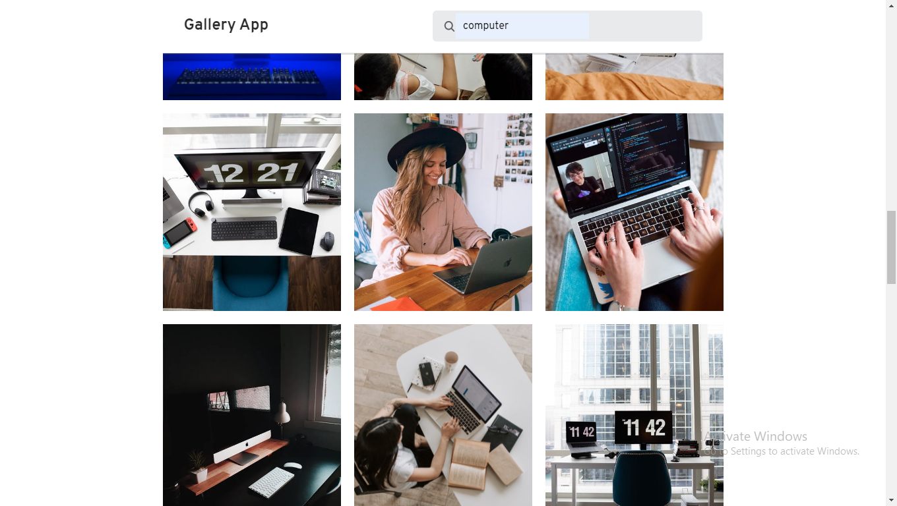

# Gallery App

To use the **Gallery App** you must get the api key from the [Pexels Api](https://www.pexels.com/api/) and place your pexels api in the `const pexelsApi = Your Api key;` on line 2 in the `script.js file` and start using the app.  
The App will be working fine when you don't have api key it will fetch from the local file `data/data.json` file. You cannot use search functionality and load more functionality when you dont't own your api key.

### `Report if there is any bug🐛 in this project.`
